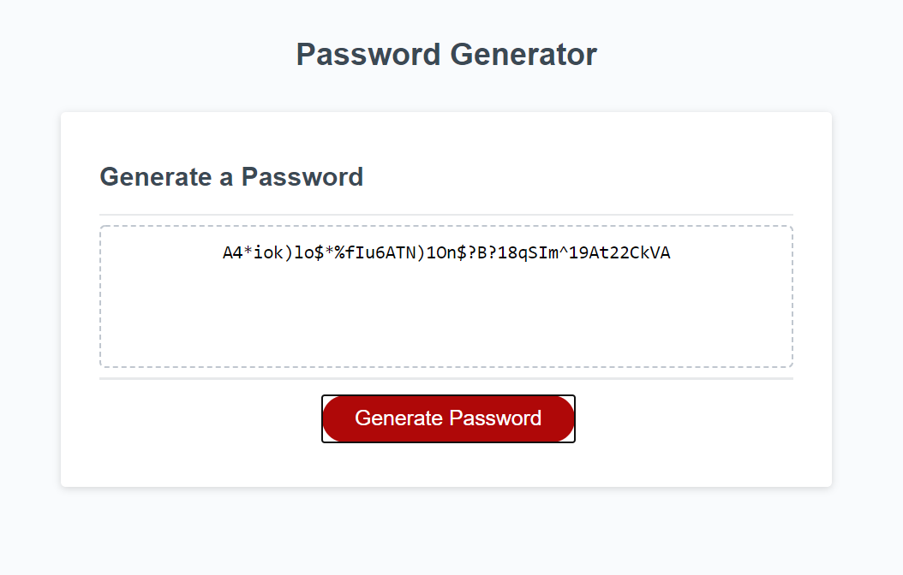

# PASSWORD GENERATOR

## PURPOSE
In an era where the ability to password-protect sensitive digitally-accessed information is a normal part of everyday life, this app gives the user the ability to create a strong password for greater security. The user is asked to define the following parameters:
- password between 7 and 129 characters long;
- inclusion of lower-case alpha characters;
- inclusion of upper-case alpha characters;
- inclusion of numerical characters; and/or
- inclusion of special characters.

## BUILT WITH
* HTML
* CSS
* JavaScript

## WEBSITE
https://smkrizan.github.io/password-generator/

### CONTRIBUTION
Made with ❤️&#9749 by Sara Krizan